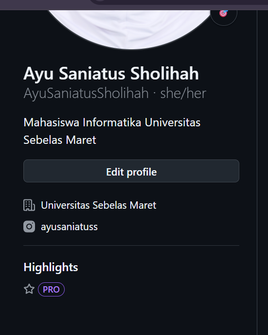
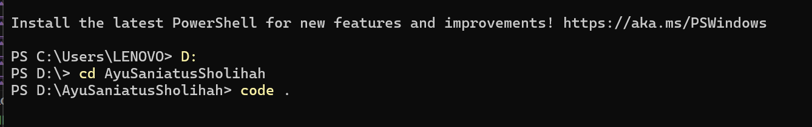

## Cara buat profil github

Masuk ke profil  

Klik new repository  

tulis nama repository, dan pastikan ceklis add a readme file  

Copy code, setelah itu lanjut buka terminal   

Arahkan file mau disimpan di D atau C, lalu ketik git clone *copy paste kede repository tadi*  

Ketikkan cd *alamat repository*  

Setelah enter, ketik code (spasi titik) *code .*  

Setelah itu akan diarahkan ke vs code dan bisa edit. Untuk melihat preview download extention markdown

