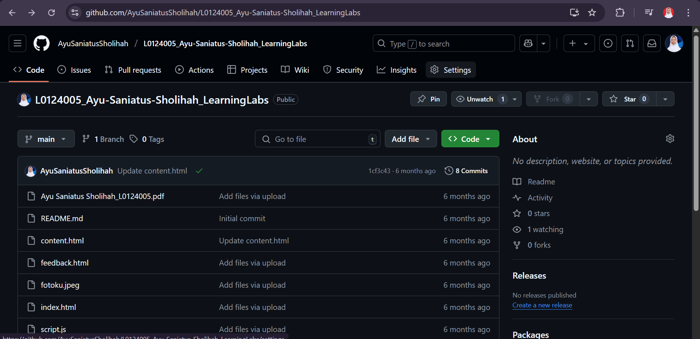
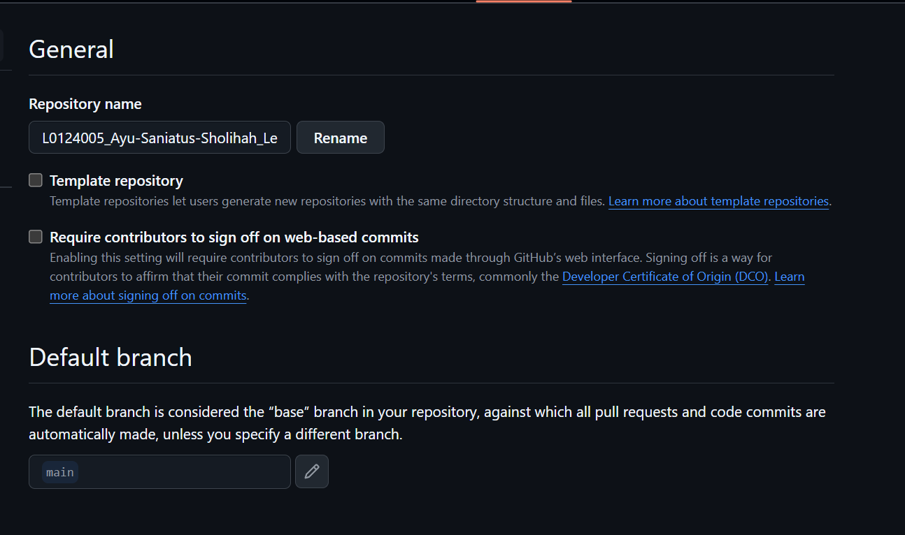
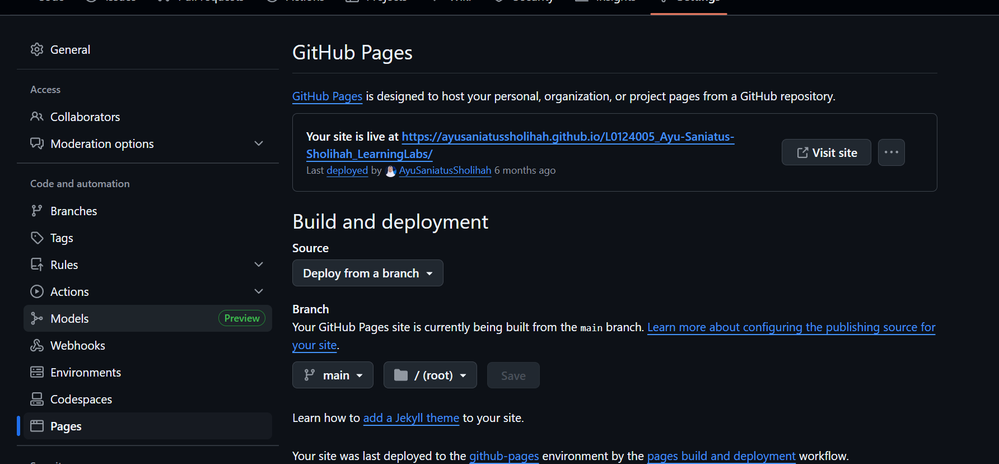
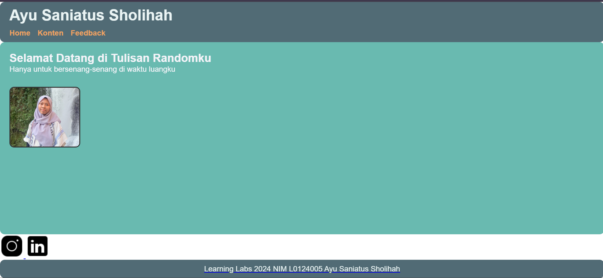

## Cara Membuka Tampilan Website di Repository

Buka repository websitenya, lalu masuk ke setting  

Lalu ke general, berinama nama domain. Dan pastikan default branch bentuk main  

Klik page, muncul link di your site is live at...  

Web berhasil untuk diakses  

