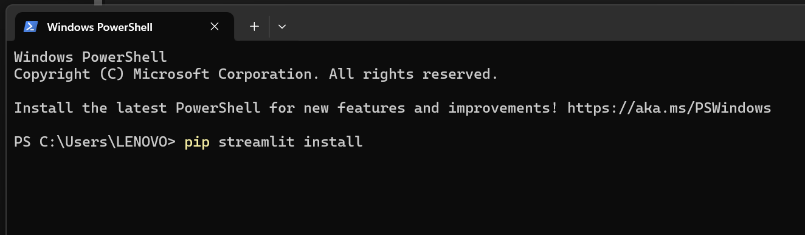
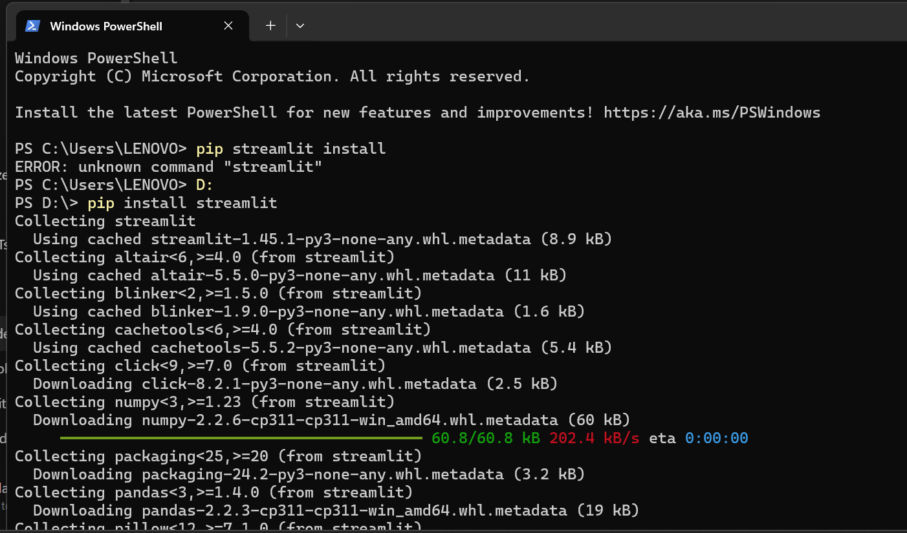
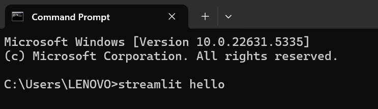

## Cara Merunning Streamlit

Buka terminal, ketik *pip streamlit install*

Tunggu instalasi

Coba tes, dengan mengetik *streamlit hello*

Setelah itu akan diarahkan ke halaman web seperti di atas

